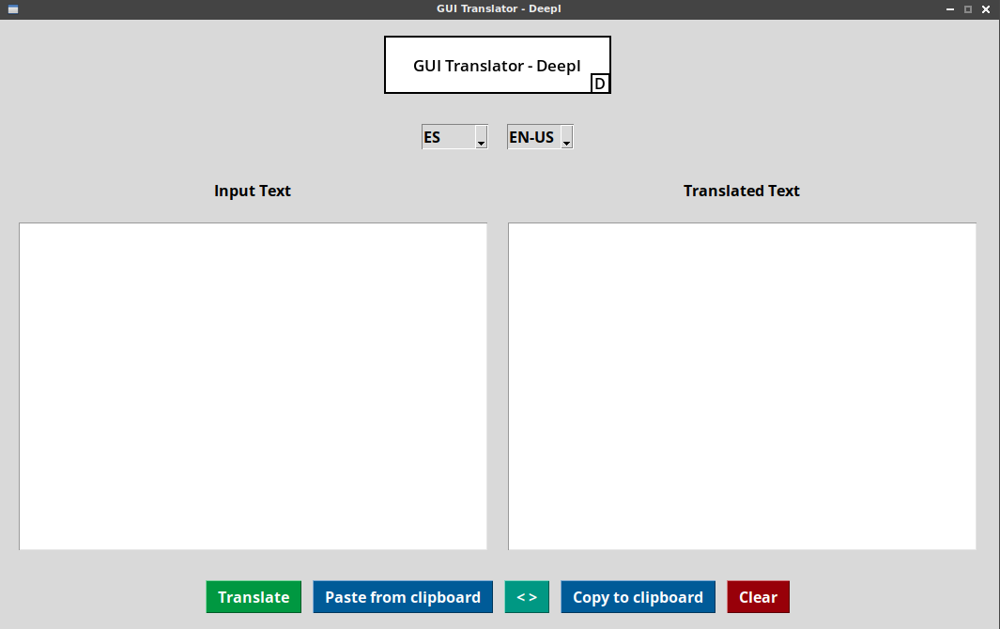

# GUI Translator - DeepL



## Overview

This GUI application allows users to translate text using the DeepL API. It provides a user-friendly interface for selecting languages, entering text for translation, and performing translation operations.

### Font Recommendation

We recommend installing the Open Sans font for optimal viewing experience. You can install it on various operating systems:

- **Debian/Ubuntu**:
  
  ```bash
  sudo apt-get install fonts-open-sans
  ```

- **Fedora**:
  
  ```bash
  sudo dnf install google-opensans-fonts
  ```

- **Arch Linux**:
  
  ```bash
  sudo pacman -S ttf-opensans
  ```

- **Windows**:
  Download and install the font from the [Google Fonts ]([Open Sans - Google Fonts](https://fonts.google.com/specimen/Open+Sans)) website.

### DeepL API Key

To use the DeepL API, you need to obtain an authentication key from the DeepL website. This key is required for accessing the translation service.

### Button Functions

- **Translate**: Initiates the translation process.
- **Paste from Clipboard**: Pastes text from the clipboard into the input text box.
- **Swap Languages**: Swaps the source and target languages.
- **Copy to Clipboard**: Copies translated text to the clipboard.
- **Clear**: Clears the input and output text boxes.

## Development Environment Setup

To set up the development environment and install the dependencies listed in the `requirements.txt` file, follow these steps:

1. Make sure you have Python 3 installed on your system.

2. Install `python3-tk` package on Linux systems:
   
   ```bash
   sudo apt install python3-tk  # for Debian/Ubuntu
   ```
- Clone the project repository.

- Navigate to the project directory and create a virtual environment:
  
  ```bash
  python3 -m venv venv
  ```

- Activate the virtual environment:
  
  - On Linux/macOS:
    
    ```bash
    source venv/bin/activate
    ```

- On Windows:
  
  ```bash
  venv\Scripts\activate
  ```

- Install the dependencies from the `requirements.txt` file:
  
  ```bash
  pip install -r requirements.txt
  ```

## License

This project is licensed under the GNU General Public License v3.0. See the [LICENSE](LICENSE) file for details.
